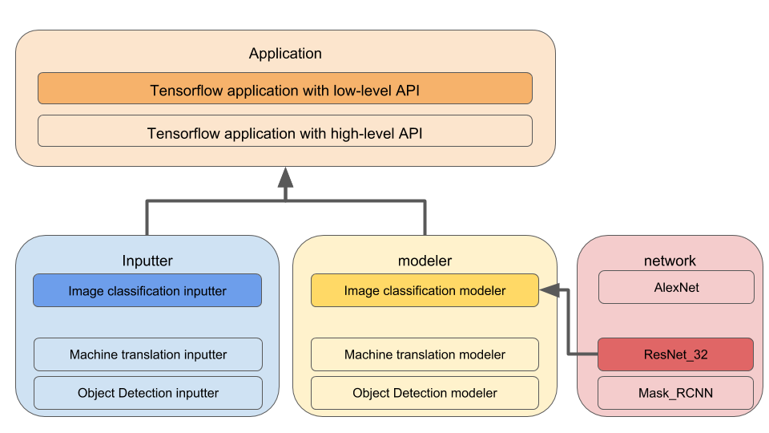

Getting Started
=====================================

* :ref:`create-app`
* :ref:`run-app`

.. _create-app:

Create a machine learning application
--------------------------------------

Model zoo creates machine learning solutions by composing reusable building blocks: 

* **Modeler**: Creates the model pipeline. It encapsulates the forward pass, the computation of loss, the evaluation metric. For reusability, the forward pass is a placeholder that can be dynamically configured to different network architectures. This allows a modeler to be applicable to a general problem. For example, we have image_classification_modeler, machine translation_modeler, object_detection_modeler ... etc.
* **Inputter**: Creates the data pipeline, which reads data from disk, shuffles the data, preprocesses and create batches. Like the modeler, an inputter is applicable to a general problem. For example, we have image_classification_inputter, machine_translation_inputter, object_detection_inputter ... etc.
* **Application**: Runs a machine learning job. In particular, it orchestrates the excution of inputter and the modeler, distributes the workload across multiple hardware devices, logs the statistics of the job and saves the trained model to disk. 

The value of having the above building blocks is they can be pre-built and re-used in many tasks -- the image_classification_modeler is meant to address for all image classification tasks. The same applies to inputters. Application is even more so, it is applicable to many different problems and only varies by the selection of framework and APIs.

Now, we can add the core algorithm and complete a machine learning solution:

* **network**: Creates a particular network architecture, such as AlexNet, VGG19, ResNet32 ... etc. It completes the solution by replacing the modeler's placeholder for forward pass.

:numref:`figure-overview` illustrates the composition of a machine learning application.

.. _run-app:

Run the applicaiton
--------------------------

blah, blah

